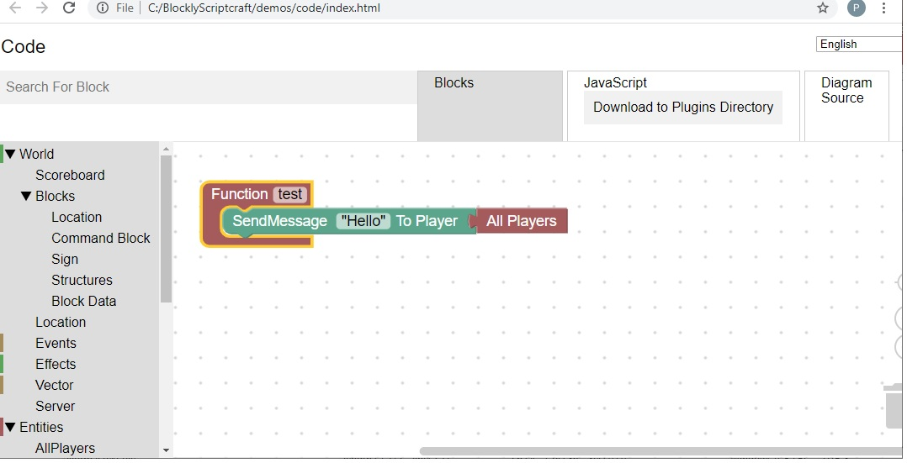

<H1>Blockly for Scriptcraft</H1>
 
BlocklyScriptcraft is another <a href="https://en.wikipedia.org/wiki/Scratch_(programming_language)">scratch</a>-like utility that allows you to create minecraft plugins 
<h2>Blockly Setup</h2>
<ul>
  <li>Download Git for windows: https://git-scm.com/download/win</li>
  <li>Run the git install executable</li>
  <li>Open a cmd window (Hold the windows key, press r, then enter the command: cmd)
  <li>Type the commands:</li>
     <ul>
        <li>cd c:\</li>
        <li>git clone https://www.github.com/Paulware/BlocklyScriptcraft</li>
     </ul> 
</ul>
  
After cloning the git repository, you can run blockly Scripcraft by opening C:\BlocklyScriptcraft\blocklyScriptcraft.html use the google chrome browser 

<h2>Minecraft Server Setup</h2> 
  <a href="http://Paulware.github.io/BlocklyScriptcraft/windowsSetup.html">Windows 10</a> 
  <a href="http://Paulware.github.io/BlocklyScriptcraft/macSetup.html">MAC OS</a> 

The project will generate Javascript that is tested as a minecraft plugin 
 
This project has an online lesson plan located: https://sites.google.com/site/multiplayerscratchminecraft/ 
<h2><a href="http://Paulware.github.io/BlocklyScriptcraft/onlineCourse.html">Online Course</a></h2>
<h2><a href="http://Paulware.github.io/BlocklyScriptcraft/">More Information</a></h2>
