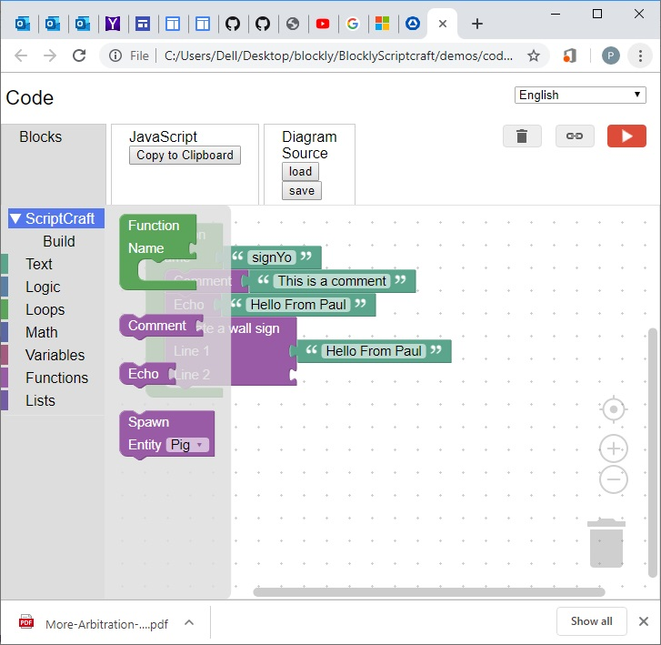

# Blockly for Scriptcraft
# Installation
* Install Git on your system: https://git-scm.com/download/win
* Open a cmd window
* Type commands:
* cd c:\ 
* git clone https://www.github.com/Paulware/BlocklyScriptcraft 
  This will create a C:\BlocklyScriptcraft directory with all the necessary files
* To get latest (after git clone command)
  git pull --all
  
To run the program navigate to C:\BlocklyScriptcraft\demos\code\index.html  

Here is a screen shot of the user interface: 

You can save and load projects to the desktop or other places on your computer.
 
**The project will generate Javascript that is built for Scriptcraft located: https://github.com/walterhiggins/ScriptCraft**
 
**Installation of Scriptcraft is described: https://github.com/walterhiggins/ScriptCraft#installation**

Google's Blockly is a web-based, visual programming editor.  Users can drag
blocks together to build programs.  All code is free and open source.

**The project page is https://developers.google.com/blockly/**

